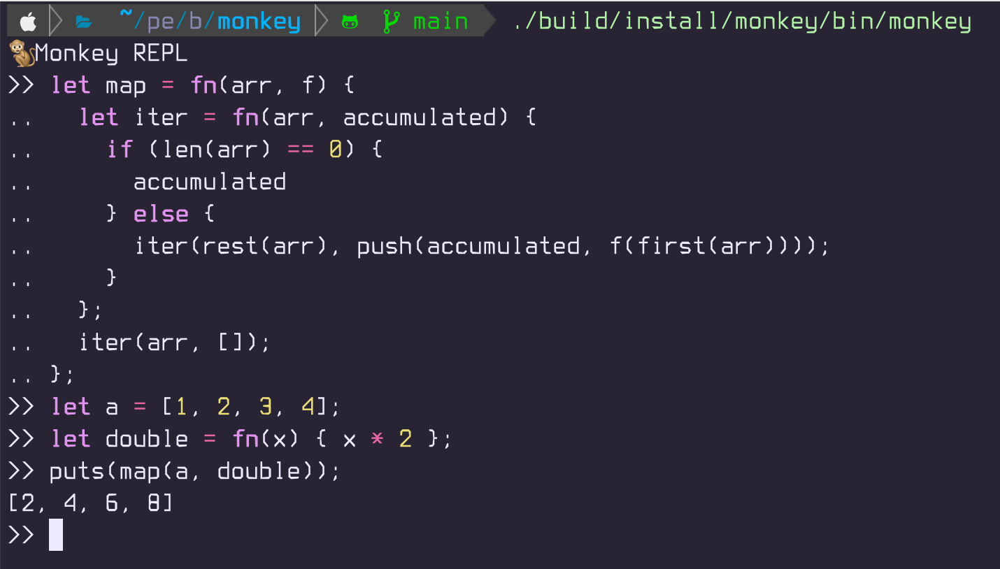

# Writing an Interpreter & Compiler in Kotlin from scratch (Handcrafted)

## Build and Run

Option 1: Gradle (dev loop)

```bash
./gradlew build
./gradlew run --console=plain
./gradlew run --console=plain --args="--lexer"    # Start REPL in lexer-only mode
./gradlew run --console=plain --args="--parser"   # Start REPL in parser-only mode
```

Option 2: Installable app distribution (zip/tar + launch script)

```bash
./gradlew installDist   # or: ./gradlew distZip
./build/install/monkey/bin/monkey
```

Option 3: GraalVM native image (native binary)

This is a common approach for distributing CLIs without requiring users to install a JVM.
It requires additional setup (GraalVM + the Gradle plugin `org.graalvm.buildtools.native`).
Once configured, the flow typically looks like:

```bash
./gradlew nativeCompile
./build/native/nativeCompile/monkey
```

## Test

```bash
./gradlew test
```

## Phases

### Part 1: Interpreter (in Kotlin)

- [x] **Lexer** — Tokenize source code into tokens
- [x] **Parser** — Build Abstract Syntax Tree (AST) from tokens
- [x] **AST** — Define node types for expressions and statements
- [x] **Evaluator** — Execute the AST (tree-walking interpreter)
- [x] **REPL** — Interactive read-eval-print loop with JLine (syntax highlighting, multi-line input, auto-indentation)
- [ ] **Parser Debug Mode** — Print AST as a tree structure in real-time during parsing (`--parser` flag)
- [x] **Extending the Interpreter** — String, built-in functions, array, and hashmap



### Part 2: Compiler + VM (Kotlin front-end, C back-end)

> **Approach:** Reuse the existing Kotlin lexer/parser/AST and write the **compiler** in Kotlin (it's just an AST visitor that emits bytecode). Serialize the bytecode to a binary format. Then write **only the VM** in C — a tight bytecode dispatch loop where C shines. This mirrors how real systems work (e.g., `javac` produces `.class` files, the JVM executes them).

- [ ] **Bytecode format** — Define opcodes, operand encoding, and serialization format (the contract between Kotlin and C)
- [ ] **Compiler** (Kotlin) — Walk the AST and emit bytecode
- [ ] **Serializer** (Kotlin) — Write bytecode to a binary file/stream
- [ ] **Virtual Machine** (C) — Read and execute bytecode
- [ ] **Tail-call optimization (TCO)** — Optimize tail-recursive calls (e.g., `return f(...)`) with a trampoline/loop to avoid JVM stack overflow

## Language Features (Monkey)

- [x] Variable bindings (`let x = 5;`, `let name = "hello";`)
- [x] Integers and booleans (`42`, `true`)
- [x] Arithmetic expressions (`1 + 2 * 3`, `-5 + 10`)
- [x] If/else expressions (`if (x > 5) { 1 }`, `if (x) { x } else { 0 }`)
- [x] Return statements (`return 10;`, `return add(1, 2);`)
- [x] Error handling (type mismatches, unknown operators)
- [x] String (`"hello world"`, `"hello" + " " + "world"`)
- [x] Built-in functions (`len("hello")`, `len([1,2])`, `now()`)
- [x] First-class functions and closures (`let add = fn(x, y) { x + y };`, `fn(x) { fn(y) { x + y } }`)
- [x] Array and index expressions (`[1, 2, 3]`, `arr[0]`)
- [x] Hashmap (`{"key": "value"}`)
- [x] Built-in functions (`puts`, `first`, `last`, `rest`, `push`)
